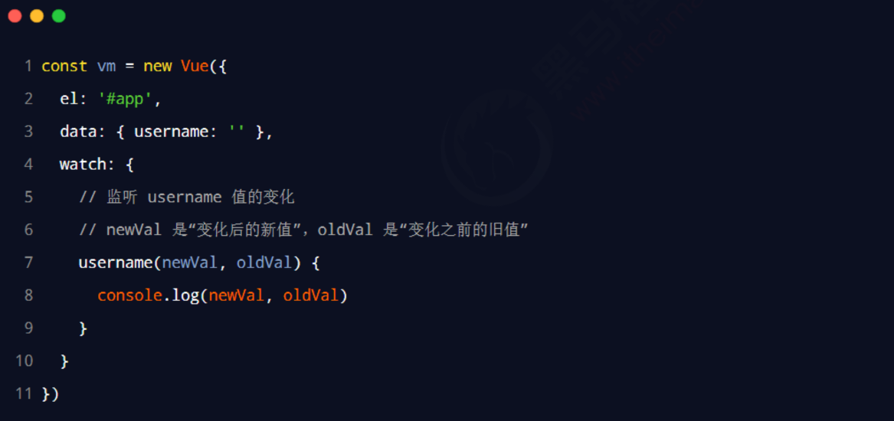
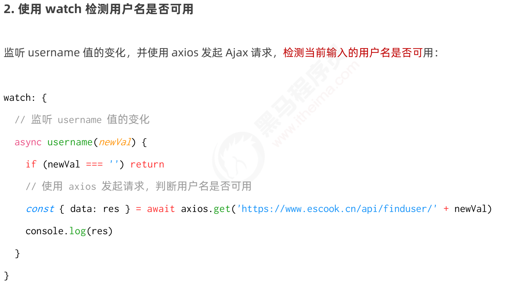
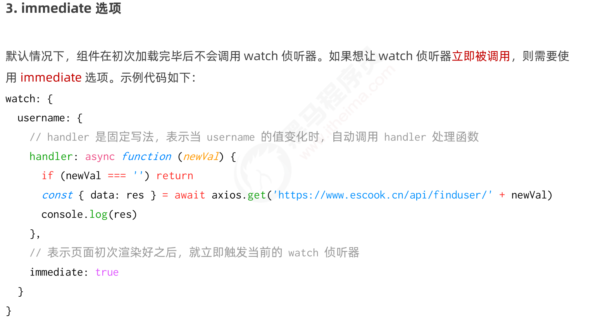
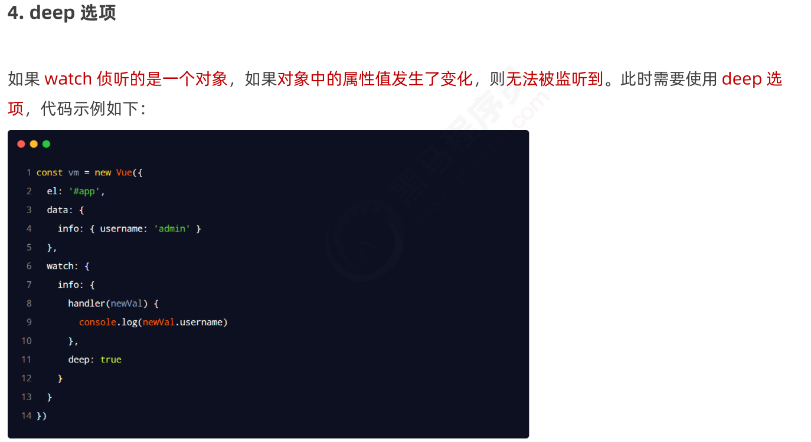
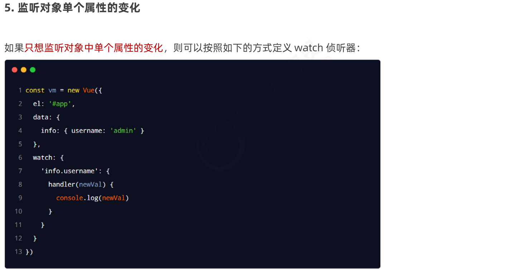
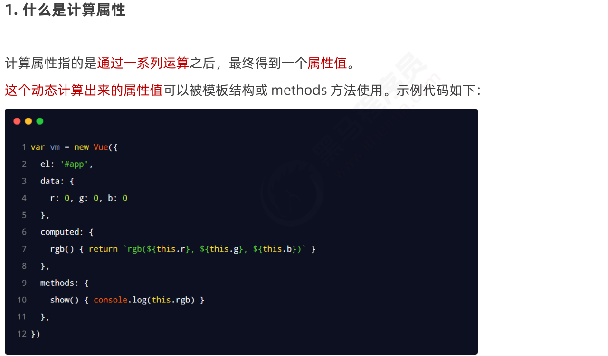
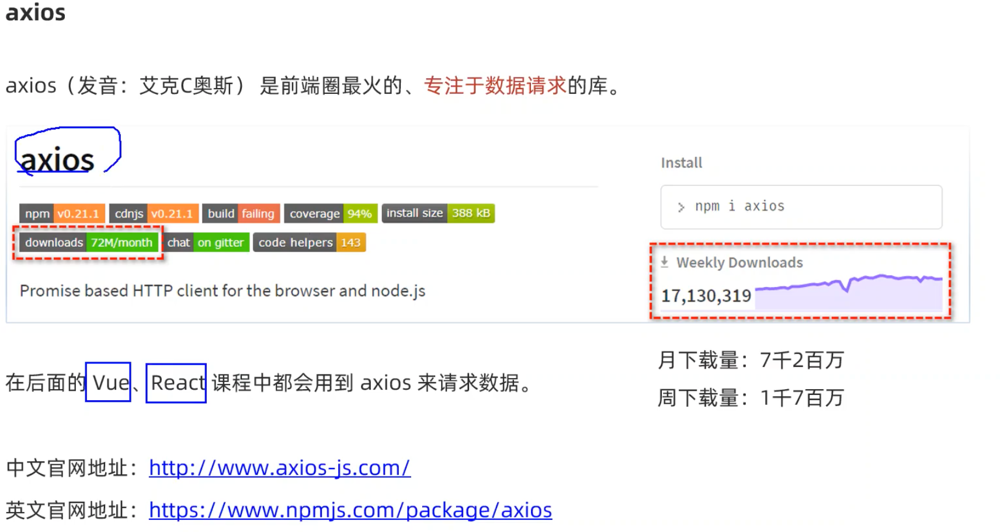
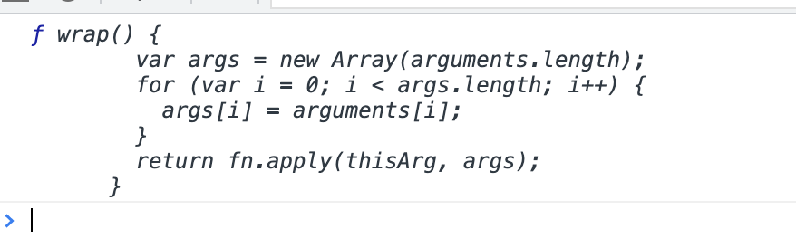
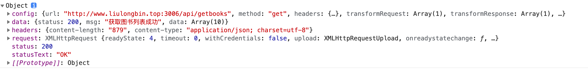
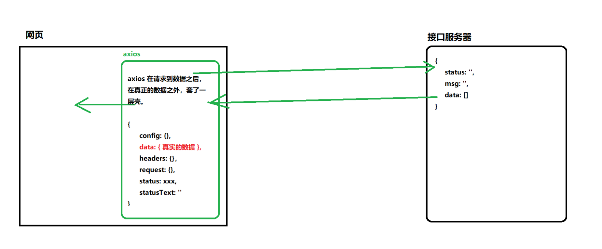

# **watch 侦听器**

watch 侦听器允许开发者监视数据的变化，从而针对数据的变化做特定的操作。

语法格式如下：





用户名是否被占用的应用场景 : 

>存在的问题，在一进入的时候没有发起请求，处理这个问题，需要修改监听器格式为对象，因为函数式的监听器不会被自动触发

```html
<!DOCTYPE html>
<html lang="en">
<head>
    <meta charset="UTF-8">
    <meta http-equiv="X-UA-Compatible" content="IE=edge">
    <meta name="viewport" content="width=device-width, initial-scale=1.0">
    <title>Document</title>
</head>
<body>
    <div id="app">
        <input type="text" v-model="username">
    </div>


    <script src="./lib/vue-2.6.12.js"></script>
    <script src="./lib/jquery-v3.6.0.js"></script>
    <script>
        const vm = new Vue({
            el: "#app",
            data: {
                username: ''
            },
            watch: {
                /*username(newVal,oldVal){
                    console.log("新值： " + newVal, "旧值： " + oldVal)
                }*/
                username(newVal){
                    if(newVal === '') return;

                    $.get('https://www.escook.cn/api/finduser/' + newVal,function(result){
                        console.log(result);
                    })
                }
            
            }
        });
    </script>
</body>
</html>
```








## 小结： 

监听器的格式

1. 方法格式的监听器
   - 缺点： 无法在刚进入页面的时候，自动触发
   - 缺点：如果监听的对象中的属性的变化，是不会触发
2. 对象格式的监听器
   - 好处：可以通过 **immediate**选项，让监听器自动触发！！
   - 好处：对象的属性的变化也可以被触发 **deep** 选项


# 计算属性




模板字符串

```js
`rgb(${this.r},${this.g},${this.b})`

 <!-- 动态绑定了一个样式对象 -->
 <div class="box" :style="{ backgroundColor: rgb }">
```


## 小结

特点： 

1. 定义的时候，要被定义为”方法“
2. 在使用计算属性的时候，当普通的属性使用即可

好处：

1. 实现了代码的复用
2. 只要计算属性中依赖的数据源变化了，则计算属性会自动重新求值


# axios




```html
    <script src="./lib/axios.js"></script>
    <script>
        console.log(axios);
    </script>
```




### 发起一个get请求

```js
        //Promise {<pending>} ， 返回的是一个Promise对象
        const result = axios({
            method: 'GET',
            url: 'http://www.liulongbin.top:3006/api/getbooks'
        })
        result.then(function(books){
            console.log(books);
        })
```







```js
        axios({
            method: 'GET',
            url: 'http://www.liulongbin.top:3006/api/getbooks'
        }).then(function(books){
            console.log(books);
        })
```


请求传参

get传参使用params: {},

post传参使用data:{}

```js
axios({
  method: 'GET',
  url: 'http://www.liulongbin.top:3006/api/getbooks'
	params: {
  	id: 1	
	}
})
```

```js
axios({
  method: 'POST',
  url: 'http://www.liulongbin.top:3006/api/post',
  data: {
    name: 'zs',
    age: 20
  }
})
```


### 发起一个post请求

```html
<body>
    <button id="btnPost">发起post请求</button>
    <script src="./lib/axios.js"></script>
    <script>
        document.querySelector('#btnPost').addEventListener('click',function(){
            axios({
                method: 'POST',
                url: 'http://www.liulongbin.top:3006/api/post',
                data: {
                    name: 'zs',
                    age: 20
                }
            }).then(function(result){
                console.log(result)
            })
        })
    </script>
</body>
```


```html
<body>
    <button id="btnPost">发起post请求</button>
    <script src="./lib/axios.js"></script>
    <script>
        document.querySelector('#btnPost').addEventListener('click',function(){
          //
            axios({
                method: 'POST',
                url: 'http://www.liulongbin.top:3006/api/post',
                data: {
                    name: 'zs',
                    age: 20
                }
            }).then(function(result){
                console.log(result)
            })
        })
    </script>
</body>
```


```html
<body>
    <button id="btnPost">发起post请求</button>
    <button id="btnGet">发起get请求</button>
    <script src="./lib/axios.js"></script>
    <script>
        document.querySelector('#btnPost').addEventListener('click',async function(){
            //如果调用某个方法的返回值是 Promise实例，则前面可以添加await! 加上await后返回的就是一个结果
            //await 只能用在被 async ’修饰‘ 的方法中
            //使用解构赋值，将右侧的大对象中的 解构出data 属性
            //解构赋值的时候使用：进行从命名
            const{ data: res } = await axios({
                method: 'POST',
                url: 'http://www.liulongbin.top:3006/api/post',
                data: {
                    name: 'zs',
                    age: 20
                }
            })
            //解构出来的值是服务器返回的值，这里的data是返回值中的数据值存储的地方
            console.log(res.data);
        })

        document.querySelector('#btnGet').addEventListener('click',async function(){
            const{data: res } = await axios({
                method: 'GET',
                url: 'http://www.liulongbin.top:3006/api/getbooks'
            })
            console.log(res.data)
        })
    </script>
</body>
```

### 最佳实践

```html
<body>
    <button id="btnPost">发起post请求</button>
    <button id="btnGet">发起get请求</button>
    <script src="./lib/axios.js"></script>
    <script>
        document.querySelector('#btnPost').addEventListener('click',async function(){
            const {data: res} = await axios.post('http://www.liulongbin.top:3006/api/post',{name: 'zs',gender: '女'})
            console.log(res)
        })

        document.querySelector('#btnGet').addEventListener('click',async function(){
            const {data: res} = await axios.get('http://www.liulongbin.top:3006/api/getbooks',{
               params: {id: 1}
           })
            console.log(res);
        })
    </script>
</body>
```


